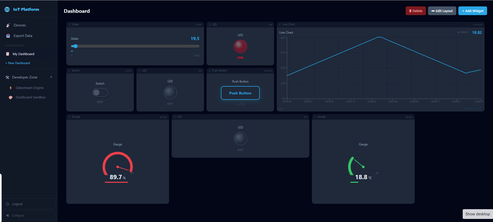

# IoT Sandbox Dashboard Platform

**A self-hosted, multi-protocol IoT dashboard with a drag-and-drop widget sandbox, omnidirectional real-time sync, an ESP32/ESP8266 Arduino C++ client library, Google Assistant Smart Home voice control, and localized Excel data export.**

[](https://nodejs.org)
[](https://react.dev)
[](https://mysql.com)
[](https://mosquitto.org)
[](https://firebase.google.com)
[](https://docs.docker.com/compose)
[](LICENSE)

---



*Live dashboard with real-time sensor readings — Gauge (89.7 % humidity, 18.8 °C temperature), LED indicators, Slider, Switch, Push Button, and a Line Chart streaming historical data.*

---

## Table of Contents

1. [Overview](#overview)
2. [Architecture & Features](#architecture--features)
3. [Virtual Pin Mapping Protocol](#virtual-pin-mapping-protocol)
4. [Getting Started](#getting-started)
   - [Option A — Docker (Recommended)](#option-a--docker-recommended)
   - [Option B — Manual Setup](#option-b--manual-setup)
5. [Google Sign-In (Firebase)](#google-sign-in-firebase)
6. [Google Assistant Smart Home](#google-assistant-smart-home)
7. [ESP32 / ESP8266 Library](#esp32--esp8266-library)
8. [Python Simulator](#python-simulator)
9. [Data Export & Timezone Handling](#data-export--timezone-handling)
10. [Project Structure](#project-structure)
11. [Configuration Reference](#configuration-reference)
12. [License](#license)

---

## Overview

IoT Sandbox Dashboard is a lightweight alternative to Blynk and ThingsBoard that you fully own and host. It connects physical hardware (ESP32, ESP8266, Raspberry Pi) to a live browser dashboard through a unified tri-protocol gateway (MQTT, HTTP REST, WebSocket). Any value written by a sensor is immediately visible on every connected dashboard — and any widget change on the dashboard is pushed back to the hardware in real time.

Voice control is built in: Google Assistant can turn devices on/off, set brightness, or adjust fan speed using the Google Smart Home API — the same virtual-pin writes that dashboard widgets use.

The project is designed to be approachable for intermediate students and makers while remaining production-capable for small-scale deployments.

---

## Architecture & Features

### Dashboard Sandbox Editor

- A **live layout editor** built with `react-grid-layout` that lets users freely add, move, resize, and delete widgets.
- Editing happens in an isolated **Sandbox mode** — changes are previewed before being committed to the live dashboard, preventing accidental disruption.
- Per-widget configuration includes color pickers, threshold editors, PWM range controls, and label formatting.
- Supported widget types: **Gauge**, **Line Chart**, **Progress Bar**, **LED** (binary and PWM modes), **Slider**, **Switch**, and **Push Button**.

### Omnidirectional State Sync Engine

- A virtual-pin-based message bus that routes values bidirectionally between hardware and all open browser sessions.
- **Transport stack** with automatic fallback:
  1. **MQTT** (primary) — lowest latency; published to `iot/{api_key}/sensor` and `iot/{api_key}/pin/{n}`
  2. **WebSocket** — persistent browser connections via Socket.IO
  3. **HTTP REST** — stateless fallback for constrained devices
- All three transports write to the same `sensor_data` table with a unified JSON schema: `{ "data": { "V0": 24.5 }, "units": { "V0": "°C" } }`
- **Origin-echo suppression** prevents a widget from receiving its own write back as an update.
- **Sequence guard** discards stale payloads when two sources race to update the same pin.

### Google Assistant Smart Home

- Full [Google Smart Home](https://developers.home.google.com/cloud-to-cloud/get-started) fulfillment endpoint (`POST /api/google-assistant/fulfillment`).
- Handles all four intents: `SYNC`, `QUERY`, `EXECUTE`, `DISCONNECT`.
- **Auto device-type mapping** — device names/types are matched to Google device profiles at runtime:
  | Name/type contains | Google device type | Supported traits |
  |--------------------|--------------------|-----------------|
  | light, led, lamp, bulb | `LIGHT` | OnOff, Brightness |
  | fan, blower | `FAN` | OnOff, FanSpeed (low/medium/high) |
  | thermostat, therm | `THERMOSTAT` | TemperatureSetting |
  | *(anything else)* | `SWITCH` | OnOff |
- Execute commands write to `sensor_data` and fan out via Socket.IO + MQTT — identical to dashboard widget presses.
- **Custom OAuth 2.0 account-linking** so Google Home can authenticate against the platform without a third-party identity provider (see [Google Assistant Smart Home](#google-assistant-smart-home)).

### Google Sign-In (Firebase Auth)

- Firebase ID tokens are verified server-side using Google's public RS256 certificates — **no firebase-admin SDK or service account file required**.
- Existing email/password accounts are automatically linked when the same e-mail is found.
- New Google users are auto-registered on first sign-in.
- The backend issues a standard platform JWT on success; all downstream API calls are auth-provider-agnostic.

### ESP32 / ESP8266 Arduino Library (`MyIoTSDK`)

- Professional-grade Arduino library with MQTT primary transport and HTTP automatic fallback.
- `writePin()` / `writePins()` — send sensor readings to the dashboard.
- `readPin()` / `onPin()` — poll or callback-receive dashboard-set values (Slider, Switch).
- `loop()` — single call handles Wi-Fi keepalive, MQTT reconnect, heartbeat, and HTTP pin polling.
- Fully compatible with ESP32 and ESP8266 boards.
- Three bundled examples: `BasicSensor`, `VirtualPins`, `FullSimulator`.

### Session Security

- JWT authentication with configurable expiry (default **8 hours**).
- Frontend enforces a **30-minute inactivity timeout** — any mouse, keyboard, scroll, or touch event resets the countdown.
- All 401 responses from the API automatically clear the session and redirect to the login page.
- Token expiry is also checked on page load and every 60 seconds while the app is open.

### Malaysia-Time-Localized Excel Export

- Multi-select virtual pin checkboxes — all pins selected by default.
- Optional date-time range filter (inputs interpreted as MYT, UTC+8).
- Data fetched as JSON from the backend (raw UTC); timezone conversion performed entirely on the client.
- Output: a styled `.xlsx` file with frozen header row and column-width formatting.
- Filename pattern: `device_data_export_{device_id}_{YYYY-MM-DD}.xlsx`

### Device Heartbeat & Offline Detection

- Every data push (HTTP POST, MQTT sensor, WebSocket) stamps `last_ping_at` so the sweeper has a consistent activity timestamp regardless of transport.
- Background worker runs every 10 seconds; any device silent for more than 30 seconds is marked **Offline**.
- Status change emitted via WebSocket to both the Devices page badge and any open dashboard widgets.
- Immediate offline detection for WebSocket-connected devices on TCP close (no need to wait for the sweeper).

---

## Virtual Pin Mapping Protocol

Virtual pins (`V0`–`V255`) are the shared address space between hardware and dashboard widgets. A datastream definition binds a pin number to a name, data type, unit, and display range.

| Pin | Name              | Type    | Direction      | Unit | Range / Behaviour                          |
|-----|-------------------|---------|----------------|------|--------------------------------------------|
| V0  | `temperature`     | double  | Device → Server | °C  | Linear ramp 15 °C → 40 °C (60-second period) |
| V1  | `humidity`        | double  | Device → Server | %   | Sine wave 30 % → 90 % (40-second period)  |
| V2  | `led_pwm`         | double  | Bidirectional  | %    | Triangle sweep 0 → 100 %; also accepts Slider input from dashboard |
| V3  | `relay`           | integer | Bidirectional  | —    | Binary toggle 0 ↔ 1 every 4 seconds; also mirrors dashboard Switch |
| V4  | `button`          | integer | Device → Server | —   | Transient pulse: HIGH (1) for 1 second, LOW (0) for 6 seconds      |

> **Naming convention:** the data key in every JSON payload is `V{pin}` — e.g. `"V0"`, `"V3"`. Widget datastreams on the dashboard are bound to this key via their `virtual_pin` field.

---

## Getting Started

### Prerequisites

- [Docker Desktop](https://www.docker.com/products/docker-desktop) (recommended path)
- **or** Node.js 20+, MySQL 8, and a Mosquitto MQTT broker for the manual path

### Option A — Docker (Recommended)

The Docker Compose file starts the backend, frontend, MySQL database, and Mosquitto broker together.

```bash
# 1. Clone the repository
git clone https://github.com/your-username/iot-sandbox-dashboard.git
cd iot-sandbox-dashboard

# 2. Copy the environment template and fill in secrets
cp docker/.env.example docker/.env
#    At minimum set: JWT_SECRET, DB_PASSWORD
#    For Google Sign-In also set: VITE_FIREBASE_* and FIREBASE_PROJECT_ID
```

#### 2a. Generate TLS certificates with mkcert

The frontend container serves HTTPS on port 5173 and requires a locally-trusted certificate pair (`cert.pem` / `key.pem`) in `docker/certs/`. [mkcert](https://github.com/FiloSottile/mkcert) creates these in one step and installs a local CA so your browser trusts them without any security warning.

**Install mkcert**

| Platform | Command |
|----------|---------|
| macOS (Homebrew) | `brew install mkcert` |
| Windows (Chocolatey) | `choco install mkcert` |
| Windows (Scoop) | `scoop bucket add extras && scoop install mkcert` |
| Linux (apt) | `sudo apt install mkcert` |
| Any | Download the binary from [github.com/FiloSottile/mkcert/releases](https://github.com/FiloSottile/mkcert/releases) |

**Generate the certificates**

```bash
# Install the local CA into your system/browser trust store (one-time, run as your normal user)
mkcert -install

# Generate cert.pem and key.pem directly into docker/certs/
mkcert -key-file docker/certs/key.pem \
       -cert-file docker/certs/cert.pem \
       localhost 127.0.0.1 ::1
```

> On Windows PowerShell, replace the backslash continuations with a single line:
> ```powershell
> mkcert -key-file docker/certs/key.pem -cert-file docker/certs/cert.pem localhost 127.0.0.1 ::1
> ```

After this step `docker/certs/` should contain `cert.pem` and `key.pem`. The files are already listed in `.gitignore` — do **not** commit them.

```bash
# 3. Start all services
cd docker
docker compose up -d

# 4. Open the dashboard
#    https://localhost:5173  (HTTPS — cert trusted by your browser via mkcert)
#    http://localhost:5174   (HTTP — auto-redirects to HTTPS)
#    Default credentials: admin@iotplatform.local / admin123
```

> On first boot the backend automatically creates the admin user and runs any pending column migrations. No manual `schema.sql` import is required when using Docker.

### Option B — Manual Setup

#### Database

```bash
# Create the database and apply the base schema
mysql -u root -p -e "CREATE DATABASE iot_platform CHARACTER SET utf8mb4 COLLATE utf8mb4_unicode_ci;"
mysql -u root -p iot_platform < database/schema.sql
```

#### Backend

```bash
cd backend
npm install

# Create a .env file (see Configuration Reference below)
cp .env.example .env

npm run dev          # development (nodemon)
# npm start          # production
```

#### Frontend

```bash
cd frontend
npm install

# Copy Firebase config (required for Google Sign-In)
cp .env.example .env
# Fill in VITE_FIREBASE_* values from Firebase Console

npm run dev          # Vite dev server → http://localhost:5173
# npm run build      # production build → dist/
```

#### MQTT Broker

Any Mosquitto-compatible broker works. A ready-made `mosquitto.conf` is provided in `docker/`.

```bash
mosquitto -c docker/mosquitto.conf
```

---

## Google Sign-In (Firebase)

The platform supports signing in with a Google account via Firebase Authentication. This is **optional** — email/password login continues to work with no Firebase configuration.

### Setup

1. Go to [Firebase Console](https://console.firebase.google.com) → **Create a project** (or open an existing one).
2. Under **Authentication → Sign-in method**, enable **Google**.
3. Under **Project Settings → Your Apps**, add a **Web app** and copy the config values.
4. Fill in the environment variables (see [Configuration Reference](#configuration-reference)):

   ```env
   # frontend/.env  (or docker/.env for Docker)
   VITE_FIREBASE_API_KEY=AIzaSy...
   VITE_FIREBASE_AUTH_DOMAIN=your-project-id.firebaseapp.com
   VITE_FIREBASE_PROJECT_ID=your-project-id
   VITE_FIREBASE_APP_ID=1:123456789:web:abcdef

   # backend/.env
   FIREBASE_PROJECT_ID=your-project-id
   ```

### How it works

| Step | What happens |
|------|-------------|
| 1 | User clicks **Sign in with Google** on the login page |
| 2 | Firebase SDK opens the Google OAuth popup and returns a Firebase ID token |
| 3 | Frontend sends the ID token to `POST /api/auth/google` |
| 4 | Backend fetches Google's RS256 public certificates, verifies the token signature and claims |
| 5 | If the email already has a password account, the Google ID is linked to it |
| 6 | A standard platform JWT is issued — all subsequent API calls are auth-provider-agnostic |

> The backend does **not** use the Firebase Admin SDK or a service account file. Certificate fetching respects Google's `Cache-Control max-age` header.

---

## Google Assistant Smart Home

Voice control lets you say *"Hey Google, turn on the living room light"* and have the command flow through to your ESP32 over MQTT — identical to pressing a dashboard widget button.

### Architecture

```
Google Home / Assistant
        │
        │  HTTPS (Smart Home fulfillment)
        ▼
POST /api/google-assistant/fulfillment
        │
   Intent router
   ┌────┴────────────────────────┐
   │  SYNC   QUERY   EXECUTE     │
   └────┬────────────────────────┘
        │ EXECUTE path
        ├─► INSERT sensor_data (HTTP-polling devices pick this up)
        ├─► Socket.IO emit  (browser dashboards + WebSocket devices)
        └─► MQTT publish  iot/{token}/set  (MQTT-connected ESP32)
```

### OAuth 2.0 Account Linking

Google Assistant requires an OAuth 2.0 flow to identify which user's devices to control.  
The platform implements a **custom authorization-code flow** — no external OAuth server required.

| Endpoint | Method | Role |
|----------|--------|------|
| `/api/auth/google-assistant-oauth` | GET | Authorization endpoint — redirects user to platform login page |
| `/api/auth/google-assistant-login` | POST | Accepts email/password **or** Firebase ID token; returns `{ redirectUrl }` with auth code |
| `/api/auth/google-assistant-token` | POST | Token endpoint — exchanges the code for a platform JWT; also handles `refresh_token` grants |

The issued JWT is the same token used by the dashboard — Google passes it back as `Authorization: Bearer` in every fulfillment request.

### Setup Guide

#### 1. Create a Google Actions project

1. Open [console.actions.google.com](https://console.actions.google.com).
2. Click **New project** → select your existing Firebase project → **Import project**.
3. Choose **Smart Home** as the category → **Start building**.

#### 2. Set the Fulfillment URL

In the Actions Console → **Develop** → **Actions** → **Fulfillment**:

```
https://<your-domain>/api/google-assistant/fulfillment
```

For local testing use [ngrok](https://ngrok.com) to expose port 3000:

```bash
ngrok http 3000
# Use the generated https://xxxx.ngrok.io URL as the fulfillment URL
```

#### 3. Configure Account Linking

In the Actions Console → **Develop** → **Account linking**:

| Field | Value |
|-------|-------|
| Linking type | OAuth + Authorization code |
| Client ID | `iot-platform-client` |
| Client secret | your `JWT_SECRET` value |
| Authorization URL | `https://<your-domain>/api/auth/google-assistant-oauth` |
| Token URL | `https://<your-domain>/api/auth/google-assistant-token` |

#### 4. Link in Google Home App

1. Open the **Google Home** app → tap **+** → **Set up device** → **Works with Google**.
2. Search for your Actions project name (e.g. *IoT Platform*) and tap it.
3. A browser opens with the platform login page — sign in.
4. Tap **Authorize** → your devices appear in Google Home.
5. Say *"Hey Google, sync my devices"* to discover all registered devices.

### Supported Voice Commands

| Command | Pin affected | Result |
|---------|-------------|--------|
| "Hey Google, turn on [device]" | V0 = 1 | Device ON |
| "Hey Google, turn off [device]" | V0 = 0 | Device OFF |
| "Hey Google, set [device] to 80 percent" | V1 = 80 | Brightness 80 % |
| "Hey Google, set fan to medium" | V2 = 66 | Fan medium speed |
| "Hey Google, sync my devices" | — | Rediscovers all devices |

### Virtual Pin → Google Trait Mapping

| Pin | Google Trait | Value range | Example command |
|-----|-------------|-------------|----------------|
| V0 | OnOff | 0 or 1 | Turn on / Turn off |
| V1 | Brightness | 0 – 100 | Set brightness to 80% |
| V2 | FanSpeed | 33 / 66 / 100 | Set fan to medium |

---

## ESP32 / ESP8266 Library

The `MyIoTSDK` library lives in `arduino-library/MyIoTSDK/`. Install it via the Arduino IDE
(**Sketch → Include Library → Add .ZIP Library**) or add it to `platformio.ini` as a local dependency.

**Required library dependencies** (install via Library Manager):

| Library       | Author            | Version |
|---------------|-------------------|---------|
| PubSubClient  | Nick O'Leary      | ≥ 2.8   |
| ArduinoJson   | Benoît Blanchon   | ≥ 6.0   |

### Basic Sketch

```cpp
#include <MyIoTSDK.h>

const char* WIFI_SSID   = "YourWiFiSSID";
const char* WIFI_PASS   = "YourWiFiPassword";
const char* SERVER_HOST = "192.168.1.100"; // IP of the host running Docker
const char* API_KEY     = "paste-your-device-api-key-here";

void setup() {
  Serial.begin(115200);

  // Connect to Wi-Fi and authenticate with the platform
  MyIoT.begin(WIFI_SSID, WIFI_PASS);
  MyIoT.connect(API_KEY, SERVER_HOST);

  // React when the dashboard Slider changes V2 (LED brightness)
  MyIoT.onPin(2, [](float percent) {
    ledcWrite(0, (uint8_t)(percent * 2.55f)); // 0–100 % → 0–255 PWM duty
  });

  // React when the dashboard Switch changes V3 (relay)
  MyIoT.onPin(3, [](float val) {
    digitalWrite(26, val > 0.5f ? HIGH : LOW);
  });
}

void loop() {
  // Must be called every iteration — handles MQTT, Wi-Fi, polling, callbacks
  MyIoT.loop();

  // Send a temperature reading on V0 every 3 seconds
  static unsigned long last = 0;
  if (millis() - last >= 3000) {
    last = millis();
    float temp = 22.0f + 3.0f * sinf(millis() / 10000.0f);
    MyIoT.writePin(0, temp, "\xC2\xB0""C"); // "°C" in UTF-8
  }
}
```

### Batch Write (efficient multi-sensor update)

```cpp
const int   pins[]   = { 0, 1 };
const float values[] = { 24.5f, 68.0f };
const char* units[]  = { "\xC2\xB0""C", "%" };
MyIoT.writePins(pins, values, 2, units); // single HTTP POST for both sensors
```

### Full Simulation Sketch

`arduino-library/MyIoTSDK/examples/FullSimulator/FullSimulator.ino` runs all five virtual-pin channels simultaneously using non-blocking `millis()` timers — the hardware equivalent of `python sensor_simulator.py --mode demo`.

---

## Python Simulator

`simulator/sensor_simulator.py` lets you test the full platform without any physical hardware.

```bash
pip install requests

# Run all five channels at once (matches FullSimulator.ino)
python simulator/sensor_simulator.py \
  --api-key YOUR_API_KEY \
  --host 192.168.1.100 \
  --mode demo

# Single-channel options
python simulator/sensor_simulator.py --mode sensor   # V0 temperature ramp
python simulator/sensor_simulator.py --mode led      # V2 PWM sweep
python simulator/sensor_simulator.py --mode switch   # V3 binary toggle
python simulator/sensor_simulator.py --mode button   # V4 pulse train
```

| Flag                | Default | Description                                      |
|---------------------|---------|--------------------------------------------------|
| `--api-key`         | —       | Device API key from the Devices page (required)  |
| `--host`            | `localhost` | Backend host                                 |
| `--port`            | `3000`  | Backend HTTP port                                |
| `--mode`            | `demo`  | `demo` \| `sensor` \| `led` \| `switch` \| `button` |
| `--pin`             | auto    | Override virtual pin number                      |
| `--interval`        | `1.0`   | Seconds between updates                          |
| `--ramp-time`       | `60`    | Seconds for one full temperature ramp cycle      |
| `--toggle-interval` | `4.0`   | Seconds between switch toggles                   |
| `--press-time`      | `1.0`   | Duration in seconds of each button press pulse   |

---

## Data Export & Timezone Handling

> **Important:** All sensor timestamps are stored in the database as **UTC**. Neither the schema nor any API endpoint converts or shifts timezone values. This is an intentional design decision that keeps the historical record portable and unambiguous.

Timezone localization is handled entirely on the **client side** at export time:

1. The frontend calls `GET /api/sensor/export-json` which returns raw UTC timestamps as ISO 8601 strings.
2. A pure JavaScript conversion adds the **Malaysia Time (MYT) fixed offset of UTC+8** to each timestamp:
   ```js
   const MYT_OFFSET_MS = 8 * 60 * 60 * 1000;
   const myt = new Date(new Date(utcString).getTime() + MYT_OFFSET_MS);
   ```
3. The converted timestamps (formatted `YYYY-MM-DD HH:MM:SS`) are written into column A of the Excel file, which is explicitly labelled **Timestamp (Malaysia Time)**.

The server-side UTC data is never modified. Users in other timezones can adapt the offset constant in `ExportPage.jsx` without any backend changes.

---

## Project Structure

```
iot-sandbox-dashboard/
├── arduino-library/
│   └── MyIoTSDK/               # ESP32/ESP8266 Arduino library (v2.0.0)
│       ├── src/
│       │   ├── MyIoTSDK.h
│       │   └── MyIoTSDK.cpp
│       ├── examples/
│       │   ├── BasicSensor/
│       │   ├── VirtualPins/
│       │   └── FullSimulator/
│       ├── library.json
│       ├── library.properties
│       └── README.md
├── backend/
│   ├── config/                 # Database pool
│   ├── controllers/
│   │   ├── deviceController.js
│   │   ├── googleAssistantController.js  # SYNC/QUERY/EXECUTE intent handlers
│   │   └── googleAuthController.js       # POST /api/auth/google (Firebase login)
│   ├── middleware/             # JWT authentication
│   ├── mqtt/                   # MQTT gateway (Mosquitto bridge)
│   ├── routes/
│   │   ├── auth.js
│   │   ├── device.js
│   │   ├── googleAssistant.js      # /api/google-assistant/*
│   │   └── googleAssistantAuth.js  # OAuth 2.0 account-linking endpoints
│   ├── services/
│   │   ├── deviceService.js
│   │   └── googleAuthService.js    # Firebase ID token verification (no Admin SDK)
│   ├── utils/                  # Shared helpers (parseMYT, coerce)
│   ├── websocket/              # Socket.IO handler & pin sync engine
│   ├── heartbeatWorker.js      # Background offline-detection sweeper
│   └── server.js               # Entry point
├── database/
│   ├── schema.sql              # Full database schema + seed data
│   └── migration_*.sql         # Incremental column migrations
├── docker/
│   ├── docker-compose.yml
│   ├── .env.example            # All env vars incl. Firebase config
│   ├── mosquitto.conf
│   └── certs/                  # TLS certs for the frontend HTTPS container
│       ├── cert.pem            # Generated by mkcert (not committed)
│       └── key.pem             # Generated by mkcert (not committed)
├── docs/
│   ├── GOOGLE_FIREBASE_SETUP.md   # Detailed Firebase project setup guide
│   └── tutorial_googleassistant.md
├── frontend/
│   ├── .env.example            # VITE_FIREBASE_* variables
│   └── src/
│       ├── components/         # Layout, modals, widget settings panels
│       ├── context/            # AuthContext (JWT + inactivity timeout)
│       ├── hooks/              # useVirtualPinSync
│       ├── pages/
│       │   ├── DevicesPage.jsx
│       │   ├── DashboardPage.jsx
│       │   ├── SandboxPage.jsx
│       │   ├── DatastreamPage.jsx
│       │   ├── GoogleAssistantPage.jsx      # Voice control setup & device list
│       │   ├── GoogleAssistantAuthPage.jsx  # OAuth account-linking login page
│       │   └── ExportPage.jsx
│       ├── services/
│       │   ├── api.js          # Axios instance
│       │   ├── socket.js       # Socket.IO client
│       │   └── firebase.js     # Firebase SDK initialization
│       └── widgets/            # Gauge, LED, Slider, Switch, Button, Chart, ProgressBar
└── simulator/
    └── sensor_simulator.py     # Python CLI hardware simulator
```

---

## Configuration Reference

### Backend (`backend/.env`)

```env
# Database
DB_HOST=localhost
DB_PORT=3306
DB_NAME=iot_platform
DB_USER=root
DB_PASSWORD=your_secure_password

# Authentication
JWT_SECRET=a-long-random-string-minimum-32-characters
JWT_EXPIRES_IN=8h          # e.g. 8h, 24h, 7d

# MQTT Broker
MQTT_HOST=localhost
MQTT_PORT=1883

# Server
PORT=3000
FRONTEND_URL=http://localhost:5173   # CORS origin; use * for LAN access

# Google / Firebase (required for Google Sign-In and Google Assistant)
FIREBASE_PROJECT_ID=your-project-id
```

| Variable              | Default     | Description                                                  |
|-----------------------|-------------|--------------------------------------------------------------|
| `JWT_SECRET`          | —           | **Required.** Sign secret for JSON Web Tokens                |
| `JWT_EXPIRES_IN`      | `8h`        | Token lifetime — balance security vs convenience             |
| `MQTT_HOST`           | `localhost` | Mosquitto broker host                                        |
| `FRONTEND_URL`        | `*`         | CORS origin; restrict to your domain in production           |
| `DB_PASSWORD`         | —           | **Required.** MySQL password                                 |
| `FIREBASE_PROJECT_ID` | —           | Firebase project ID for verifying Google sign-in tokens      |

### Frontend (`frontend/.env`)

```env
# Firebase Web App config (from Firebase Console → Project Settings → Your Apps)
VITE_FIREBASE_API_KEY=AIzaSy...
VITE_FIREBASE_AUTH_DOMAIN=your-project-id.firebaseapp.com
VITE_FIREBASE_PROJECT_ID=your-project-id
VITE_FIREBASE_APP_ID=1:123456789:web:abcdef
```

> When using Docker, all variables live in `docker/.env` and are injected into both containers by Docker Compose. Copy `docker/.env.example` to get started.

---

## License

This project is released under the [MIT License](LICENSE).

---

*Built for students, makers, and small-scale IoT deployments. Inspired by Blynk and ThingsBoard.*
